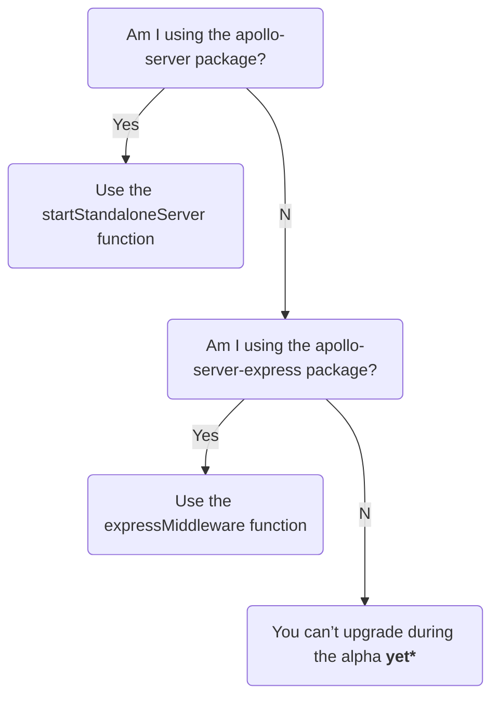

> ⚠️ **Apollo Server 4 is out in public alpha.** It is not yet feature-complete, and breaking changes might occur between this release and general availability. [Learn about release stages.](https://www.apollographql.com/docs/resources/release-stages/#open-source-release-stages)
>
>  Apollo Server 4 introduces many across-the-board changes, and we are working on updating our documentation to reflect these changes. This article explains which features _do_ require code changes and how to make them.

This major release focuses on improving Apollo Server's extensibility and making it simpler to use, maintain, and document. To learn more about the inspiration behind this release, see the [Apollo Server Roadmap](https://github.com/apollographql/apollo-server/blob/main/ROADMAP.md).

The Apollo Server 4 alpha provides the following features, with more to come with the full release:
* A simple well-defined API with a stable HTTP abstraction, enabling contributors to easily [build and maintain integrations](/integrations/building-integrations) in their preferred framework.
* A new `@apollo/server` package, combining numerous [smaller packages](#combining-packages-into-apolloserver) and including the [`startStandaloneServer`](#startstandaloneserver) and [`expressMiddleware`](#expressmiddleware) functions.

During Apollo Server 4's alpha, we are actively looking to gather feedback and [issues](https://github.com/apollographql/apollo-server/issues/new/choose) from community members and customers.

> For a list of all breaking changes, see the [changelog](https://github.com/apollographql/apollo-server/blob/main/CHANGELOG.md).

## Bumped dependencies

### Node.js
Apollo Server 4 supports Node.js 14 and later. This includes all [LTS and Current versions at the time of release](https://nodejs.org/en/about/releases/).

If you're using an older version of Node.js, upgrade your runtime before upgrading to Apollo Server 4.

### `graphql`

Apollo Server has a peer dependency on [`graphql`](https://www.npmjs.com/package/graphql) (the core JS GraphQL implementation), which means you are responsible for choosing the version installed in your app.

Apollo Server 4 supports `graphql` v16.3.0 and later. (Apollo Server 3 supported `graphql` v15.3.0 through v16.)

If you're using an older version of `graphql`, upgrade it to a supported version before upgrading to Apollo Server 4.

## Removed integrations

Apollo Server 3 provides built-in framework integrations with the intent of making Apollo Server approachable for all developers regardless of their framework of choice. Apollo Server 4 removes these built-in integrations, enabling developers to build and maintain their own integrations in the frameworks they know best.

For those migrating from Apollo Server 3 to Apollo Server 4, use the below flowchart to see your migration path:



If you are currently using the `apollo-server` package, you should switch to using the [`startStandaloneServer`](#startstandaloneserver-function) function. If you are presently using the `apollo-server-express` package, you should switch to using the [`expressMiddleware`](#expressmiddleware) function.

If you are using any other Apollo Server 3 framework integration package, you can’t upgrade during the AS4 alpha release _yet_. Please help us by [building new integrations](/building-integrations) or [helping maintain existing integrations](https://github.com/apollographql/apollo-server/labels/integration-collaborators) to ensure there is an Apollo Server 4 integration for your favorite framework.

Apollo Server 4 also removes the built-in dependency on the `cors` and `body-parser` libraries (excluding the `startStandaloneServer` function).

### Wrapping for framework-specific libraries

Apollo Server 3 is distributed as a [collection of different packages](/apollo-server/integrations/middleware) for different environments and web frameworks.

For [several reasons](https://github.com/apollographql/apollo-server/blob/main/ROADMAP.md#replace-9-core-maintained-bindings-with-a-stable-http-abstraction), these additional core-maintained integrations have caused friction in the development process, slowing down work on Apollo Server.

Apollo Server 4 replaces this static set of hard-coded integrations
with a stable API. Apollo Server 4's well-defined API enables collaborating developers to [maintain](https://github.com/apollographql/apollo-server/labels/integration-collaborators) and [build new integrations](/building-integrations) for the frameworks they know best.

Apollo Server 4 removes the below integration packages:
* [`apollo-server-fastify`](https://www.npmjs.com/package/apollo-server-fastify)
* [`apollo-server-hapi`](https://www.npmjs.com/package/apollo-server-hapi)
* [`apollo-server-koa`](https://www.npmjs.com/package/apollo-server-koa)
* [`apollo-server-lambda`](https://www.npmjs.com/package/apollo-server-lambda)
* [`apollo-server-micro`](https://www.npmjs.com/package/apollo-server-micro)
* [`apollo-server-cloud-functions`](https://www.npmjs.com/package/apollo-server-cloud-functions)
* [`apollo-server-cloudflare`](https://www.npmjs.com/package/apollo-server-cloudflare)
* [`apollo-server-azure-functions`](https://www.npmjs.com/package/apollo-server-azure-functions)

> We are looking for volunteers to build and maintain these integrations! See the [issues with the 'integration-collaborators' label](https://github.com/apollographql/apollo-server/labels/integration-collaborators) to join the discussion about your favorite web framework today.


### `body-parser` & `cors` wrapping

Apollo Server 4 no longer wraps the [`cors`](https://github.com/expressjs/cors) or [`body-parser`](https://www.npmjs.com/package/body-parser) libraries (excluding the [`startStandaloneServer`](#startstandaloneserver) function).

If you want to use either `cors` or `body-parser`, you can manually add both libraries to your framework-specific middleware.

Below is an example of setting up `cors` and `body-parser` using the [`expressMiddleware`](#expressmiddleware) function:

<MultiCodeBlock>

```ts
import { ApolloServer, expressMiddleware } from '@apollo/server';
import express from 'express';
import http from 'http';
import cors from 'cors';
import bodyParser from 'body-parser';

const server = new ApolloServer({
  typeDefs,
  resolvers,
});

await server.start();
const app = express();
const httpServer = http.createServer(app);

// We set up our Express server's middleware:
// 1. using the `cors` and `body-parser` libraries, and
// 2. passing in an `ApolloServer` instance to the `expressMiddleware` function,
// attaching Apollo Server to our Express server
app.use(cors(), bodyParser.json(), expressMiddleware(server));
await new Promise<void>((resolve) => httpServer.listen({ port: 4000 }, resolve));

console.log(`🚀 Server ready at http://localhost:4000`);
```

</MultiCodeBlock>

Apollo Server 4's new [`startStandaloneServer`](#apolloserverstandalone-and-startstandaloneserver) function (e.g., the replacement for the batteries-included `apollo-server` package) includes both the `body-parser` and `cors` packages under the hood, but neither package is configurable.

### Connect

[Connect](https://github.com/senchalabs/connect) is a predecessor of Express. Apollo Server 4 no longer supports Connect out of the box, though interested developers could write a connect-specific middleware using the Apollo Server 4 API. A PR to this migration guide is welcome if someone does this!

## Removed constructor options

The following `ApolloServer` constructor options have been removed in favor of other features or configuration methods.

### `dataSources`

In Apollo Server 3, the top-level [`dataSources` constructor option](/apollo-server/data/data-sources#adding-data-sources-to-apollo-server) enabled you to provide `DataSource` subclasses to the [`context`](/apollo-server/data/resolvers/#the-context-argument) object.

In Apollo Server 4, we remove the `dataSources` constructor option to provide a more transparent way of adding data sources to the `context` object:

<MultiCodeBlock>

```ts {35-44}
// Simple example data source
class DogsDataSource {
  constructor() {}

  async getDogs() {
    return [{ name: 'Fido' }];
  }
}

// We can create a TS interface to ensure our dataSources are
// correctly typed in our context
interface MyContext {
  dataSources: {
    dogs: DogsDataSource;
  }
}

// Create a new ApolloServer instance passing in the
// MyContext interface
const server = new ApolloServer<MyContext>({
  typeDefs: `
    type Query { dog: Dog }
    type Dog { name: String }
  `,
  resolvers: {
    Query: {
      dog: async (_, __, context) => {
        return (await context.dataSources.dogs.getDogs())[0];
      },
    },
  },
});

const { url } = await startStandaloneServer(server, {
  async context() {
    // This function is called for every incoming operation, and
    // returns the context object
    return {
      // Create a new instance of each data source for every operation
      dataSources: {
        dogs: new DogsDataSource(),
      },
    };
  },
  listen: { port: 4000 },
});

console.log(`Server ready at ${url}`);
```

```js {25-34}
// Simple example data source
class DogsDataSource {
  constructor() {}

  async getDogs() {
    return [{ name: 'Fido' }];
  }
}

const server = new ApolloServer({
  typeDefs: `
    type Query { dog: Dog }
    type Dog { name: String }
  `,
  resolvers: {
    Query: {
      dog: async (_, __, context) => {
        return (await context.dataSources.dogs.getDogs())[0];
      },
    },
  },
});

const { url } = await startStandaloneServer(server, {
  async context() {
    // This function is called for every incoming operation, and
    // returns the context object
    return {
      // Create a new instance of each data source for every operation
      dataSources: {
        dogs: new DogsDataSource(),
      },
    };
  },
  listen: { port: 4000 },
});

console.log(`Server ready at ${url}`);
```

</MultiCodeBlock>

In the above example, we create a `DogsDataSource` class and then instantiate a new `DogsDataSource` within the object returned by the `context` function. Now with every incoming operation, the `context` function returns an object containing a new instance of `DogsDataSource`, accessible to our resolvers from `context.dataSources.dogs`.

Expand the panel below for another example of setting up a data source using the `RESTDataSource` class:

<ExpansionPanel title="Click to expand">

<MultiCodeBlock>

```ts
import { ApolloServer, startStandaloneServer } from '@apollo/server';
import { RESTDataSource } from 'apollo-datasource-rest';
import { KeyValueCache } from '@apollo/utils.keyvaluecache';

// RESTDataSource example
class BooksAPI extends RESTDataSource {
  private cache: KeyValueCache<string>;
  constructor(cache) {
    super();
    this.baseURL = 'https://the-one-api.dev/v2/';
    // initialize the data source with our cache
    this.initialize(cache);
  }

  async getBooks() {
    const { docs } = await this.get(`book/`);
    return docs;
  }
}

// We can create a TS interface to ensure our dataSources are
// correctly typed in our context
interface MyContext {
  dataSources: {
    booksAPI: BooksAPI;
  }
}

const server = new ApolloServer<MyContext>({
  typeDefs: `
    type Query { getBooks: [Book] }
    type Book { name: String, _id: String }
  `,
  resolvers: {
    Query: {
      getBooks: async (_, __, context) => {
        return await context.dataSources.booksAPI.getBooks();
      },
    },
  },
});

const { url } = await startStandaloneServer(server, {
  async context() {
    return {
      dataSources: {
        booksAPI: new BooksAPI({ cache: server['internals'].cache }),
      },
    };
  },
  listen: { port: 4000 },
});

console.log(`Server ready at ${url}`);
```

</MultiCodeBlock>

</ExpansionPanel>

### `modules`
In Apollo Server 3, there are [several ways](https://github.com/apollographql/apollo-server/issues/6062) to provide your `ApolloServer` instance with a schema. One of these ways is using the `modules` constructor option, which  uses the `buildServiceDefinition` function under the hood to specify a schema using an array of `typeDefs` and `resolvers` objects.

To simplify its API, Apollo Server 4 removes the `modules` constructor option. You can replace any previous usage of the `modules` constructor option with  the following syntax:

```js
new ApolloServer({
  typeDefs: modules.map({ typeDefs } => typeDefs,
  resolvers: modules.map({ resolvers } => resolvers,
})
```

## Removed features

Several small features have been removed from Apollo Server 4.

### Health checks

In Apollo Server 3, the health check feature supports a simple `HTTP`-level health check that always returns a 200 status code.

In Apollo Server 4, we have removed the health checks feature. We found that running a trivial GraphQL query was a better way of checking the status of your server because a query ensures your server successfully serves traffic _and_ performs GraphQL operations.

Every GraphQL server supports a trivial query that requests the [`__typename`](/apollo-server/schema/schema/#the-__typename-field) of the top-level `Query` type.  This means every GraphQL server can respond to a `GET` request to a URL, such as:

```bash
https://your.server/?query=%7B__typename%7D
```

### Path parsing
Apollo Server 4 removes support for URI path parsing (i.e., removing Apollo Server 3's previous default `/graphql` path ). If you'd like to mount your GraphQL server at a specified URL, you can use your framework's specific middleware to do so.

### `__resolveObject`

In Apollo Server 4, we removed the dependency on `@apollographql/apollo-tooling`, additionally removing the `__resolveObject` pseudo-resolver. The `__resolveObject` function was a predecessor to
the [`__resolveReference`](/federation/api/apollo-subgraph/#__resolvereference) method.

### `formatResponse`
In Apollo Server 3, the `formatResponse` hook enables you to transform the structure of GraphQL response objects before they're sent to a client.

Apollo Server 4 removes the `formatResponse` hook. We instead recommend using the `willSendResponse` plugin API to do the same thing:

```ts
const apolloServerInstance = new ApolloServer<MyContext>({
  typeDefs,
  resolvers,
  plugins: [
    {
      async requestDidStart() {
        return {
            // The willSendResponse event fires whenever Apollo Server is
            // about to send a response for a GraphQL operation.
          async willSendResponse({ response }) {
            // Transform the response's structure as needed
          },
        };
      },
    },
  ],
});
```

### Support for older gateway versions

Apollo Server 4 drops support for [`@apollo/gateway` versions](/federation/api/apollo-gateway/) below v0.35.0.

### Fields from `GraphQLRequestContext` and `GraphQLServerContext`
In Apollo Server 4, the `debug` and `schemaHash` fields are no longer available on `GraphQLRequestContext`.

The `schemaHash` field was an unstable hash of the introspection JSON of a schema, created for the `apollo-server-plugin-operation-registry` package. Note that the `schemaHash` field is different from the hash of the schema SDL, which schema reporting uses.

Additionally, Apollo Server 4 removes the `persistedQueries` field from `GraphQLServerContext`.

### Dropping Gateway types

In Apollo Server 2, the TypeScript type used for the `gateway` constructor options is called `GraphQLService`. In Apollo Server 3, the TypeScript type is called `GatewayInterface`.

Apollo Server 4 drops the exports for both the `SchemaChangeCallback` and `GraphQLService` types. We recommend using the `GatewayInterface` type instead.

This `GatewayInterface` type requires the following:

- The `stop` method must be present.
- The `executor` method must async
- The `apollo` option must be passed to the `load` method.

Additionally, the `ExecutionResult` type from `graphql-js` replaces the similar `GraphQLExecutionResult` type (returned by `executor`). The types are essentially the same, except that `data` and `extensions` are now `Record<string, unknown>`, rather than `Record<string, any>`.

## Changes to framework integrations

Apollo Server 4 [removes built-in framework integrations](#removed-integrations) and fundamentally changes the Apollo Server API by no longer subclassing `ApolloServer`.

### `expressMiddleware`

> If you are using Apollo Server 3's `apollo-server-express` package, you want to use the `expressMiddleware` function from the `@apollo/server` package in Apollo Server 4.

In Apollo Server 3, you can use the `apollo-server-express` package to attach Apollo Server to an [`Express` server](https://expressjs.com/).

Apollo Server 4 introduces the [`expressMiddleware`](https://github.com/apollographql/apollo-server/blob/main/packages/server/src/express/index.ts) function from the `@apollo/server` package, enabling you to attach an `ApolloServer` instance to an [Express](https://expressjs.com/) server without switching packages.

The `expressMiddleware` function accepts an `ApolloServer` instance, and as its name implies, you can set up `expressMiddleware` while adding other middleware to your `Express` server:

<MultiCodeBlock>

```ts {18}
import express from 'express';
import http from 'http';
import cors from 'cors';
import { json } from 'body-parser';
import { ApolloServer, expressMiddleware } from '@apollo/server';
import { typeDefs, resolvers } from ('./schema');

const server = new ApolloServer({
  typeDefs,
  resolvers,
});

const app = express();
const httpServer = http.createServer(app);

await server.start();
// Pass an ApolloServer instance to the expressMiddleware function
app.use(cors(), json(), expressMiddleware(server));
await new Promise<void>((resolve) => httpServer.listen({ port: 4000 }, resolve));

console.log(`🚀 Server ready at http://localhost:4000`);
```

```js {18}
import express from 'express';
import http from 'http';
import cors from 'cors';
import { json } from 'body-parser';
import { ApolloServer, expressMiddleware } from '@apollo/server';
import { typeDefs, resolvers } from ('./schema');

const server = new ApolloServer({
  typeDefs,
  resolvers,
});

const app = express();
const httpServer = http.createServer(app);

await server.start();
// Pass an ApolloServer instance to the expressMiddleware function
app.use(cors(), json(), expressMiddleware(server));
await new Promise((resolve) => httpServer.listen({ port: 4000 }, resolve));

console.log(`🚀 Server ready at http://localhost:4000`);
```

</MultiCodeBlock>

Note, the `expressMiddleware` function has no runtime dependency on `express` (or any other package).


### New approach to serverless frameworks

In Apollo Server 3, our approach to creating serverless frameworks involved subclassing `ApolloServer` and overriding the [`serverlessFramework()`](https://github.com/apollographql/apollo-server/blob/5188b1ee408b5e2a983662b0f3a15283c071e522/packages/apollo-server-core/src/ApolloServer.ts#L813) function to return `true`.

In Apollo Server 4,  serverless integrations differentiate themselves from other integrations by calling `server.startInBackgroundHandlingStartupErrorsByLoggingAndFailingAllRequests()`. The length of this function's name discourages its use when building non-serverless apps because the shorter `await server.start()` is available.

Apollo Server 4's other framework integrations expect the developer first to call `await server.start()`, before validating that the server has started by calling `server.assertStarted()`.

## Changed constructor options

### `debug`

In Apollo Server 4, the `debug` constructor option has been renamed `includeStackTracesInErrorResponses`:

```ts
const apolloServerInstance = new ApolloServer<MyContext>({
  typeDefs,
  resolvers,
  includeStackTracesInErrorResponses: true,
});
```

<<<<<<< HEAD
<<<<<<< HEAD
<<<<<<< HEAD
<<<<<<< HEAD
const { url } = await startStandaloneServer(apolloServerInstance, {
  context: async ({req, _res}) => ({
    token: await getTokenForRequest(req),
  },
  listen: { port: 4000 },
});


<<<<<<< HEAD
<<<<<<< HEAD
Note that you should only assume that the objects passed to your context function are http.IncomingMessage and http.ServerResponse objects, not necessarily their Express subclasses.
=======
=======
As part of this change, if you don't provide your own logger, the default log level has been changed to `DEBUG` (e.g., instead of `INFO`).
=======
=======
>>>>>>> 3128a127b (Rebase and get up to date)
=======
>>>>>>> 4ddf78827 (Start context section)
As part of this change, if you don't provide your own logger, the default log level has been switched to `DEBUG` (e.g., instead of `INFO`).
=======
As part of this change, if you don't provide your own logger, the default log level is now set to `DEBUG` (instead of `INFO`).
>>>>>>> d43956fe9 (Another pass over migration)

### `Config` type name
In Apollo Server 4, the TypeScript name of the constructor options object has changed from `Config` to the more aptly named, `ApolloServerOptions`.

## Changed Features

<<<<<<< HEAD
<<<<<<< HEAD
<<<<<<< HEAD
<<<<<<< HEAD
###  `ApolloServerStandalone` and `startStandaloneServer`
Apollo Server 3 included a "batteries-included" version of `ApolloServer` designed to help developers get started quickly. This "batteries-included" version of `ApolloServer`  was less configurable, but included helpful defaults to reduce set up time.
>>>>>>> d8b77eefb (Start changed features)
<<<<<<< HEAD
>>>>>>> 736356c2f (Start changed features)
=======
=======
### `startStandaloneServer` function
<<<<<<< HEAD
Apollo Server 3 included a "batteries-included" `apollo-server` package, designed to help developers get started quickly. The "batteries-included" version of `ApolloServer`  was less configurable, but included helpful defaults to reduce set up time.
>>>>>>> 23ef9f211 (update from the version-4 branch)
<<<<<<< HEAD
>>>>>>> adfe5453c (update from the version-4 branch)
=======
=======
=======
### `startStandaloneServer` function
>>>>>>> 4ddf78827 (Start context section)
Apollo Server 3 has a "batteries-included" `apollo-server` package designed to help developers get started quickly. The "batteries-included" version of `ApolloServer`  is less configurable, but includes useful defaults to reduce setup time.
>>>>>>> eca61a86d (Continue documenting startStandaloneServer)
>>>>>>> f5dd9d4c6 (Continue documenting startStandaloneServer)
=======
Apollo Server 3 has a "batteries-included" `apollo-server` package designed to help developers get started quickly. The "batteries-included" version of `ApolloServer`  is less configurable, but includes useful defaults to reduce setup time.
>>>>>>> 3128a127b (Rebase and get up to date)
=======
The below features have changed in Apollo Server 4.

<<<<<<< HEAD
### `startStandaloneServer` function
>>>>>>> 6f32dc062 (Add more tables)
=======
### `startStandaloneServer`
>>>>>>> d03825c01 (Start execute operation)

> If you are using Apollo Server 3's "batteries included" `apollo-server` package, you want to use the `startStandaloneServer` function from the `@apollo/server` package in Apollo Server 4.

Apollo Server 3 has a "batteries-included" `apollo-server` package designed to help developers get started quickly. The "batteries-included" version of `ApolloServer`  is less configurable but includes useful defaults to reduce setup time.

In Apollo Server 4, we introduce the `startStandaloneServer` function in the main `@apollo/server` package. The concept of the `startStandaloneServer` function is similar to the "batteries-included" `ApolloServer`, giving developers a more streamlined setup experience without offering as much configuration. Note, the `startStandaloneServer` function from `@apollo/server` has a runtime dependency on `express`.

Below is the high-level syntax for setting up the `startStandaloneServer` function:
<MultiCodeBlock>

```ts {19}
import { ApolloServer, startStandaloneServer } from "@apollo/server";

// An interface for ensuring that your context object contains
// all of the properties you need, and those properties
// are typed correctly.
interface MyContext {
  token: String
}

// Create a new ApolloServer instance, passing in the MyContext
// interface, enabling you to provide typing for your context
const server = new ApolloServer<MyContext>({
  typeDefs,
  resolvers,
});

// startStandaloneServer returns a promise containing the URL where
// your server is listening
const { url } = await startStandaloneServer(server, options)
```

```js {11}
import { ApolloServer, startStandaloneServer } from "@apollo/server";

// Create a new ApolloServer instance
const server = new ApolloServer({
  typeDefs,
  resolvers,
});

// startStandaloneServer returns a promise containing the URL where
// your server is listening
const { url } = await startStandaloneServer(server, options)
```

</MultiCodeBlock>

The `startStandaloneServer` function accepts two arguments; the first is the instance of `ApolloServer` that should begin listening for incoming requests. The second is an object for setting up your server's options, which accepts the following properties:

| Name  | Description  |
|---|---|
| `context` | <p>You can optionally provide a `context` _function_, which should return [an object](/apollo-server/data/resolvers/#the-context-argument) your resolvers will have access to.</p> |
| `listen` |  <p>These options are passed to the `listen` method of the under-the-hood `http.Server`. <p></p>Supported options are listed in the documentation for [net.Server.listen](https://nodejs.org/api/net.html#net_server_listen_options_callback).</p> |

Below is a complete example of setting up the `startStandaloneServer` function:

<MultiCodeBlock>

```ts
import { ApolloServer, startStandaloneServer } from "@apollo/server";
import { typeDefs, resolvers } from "./schema";

interface MyContext {
  token: string;
}

const apolloServerInstance = new ApolloServer<MyContext>({
  typeDefs,
  resolvers,
});

const { url } = await startStandaloneServer(apolloServerInstance, {
  // This function is called for every incoming GraphQL request
  context: async ({req, res}) => ({
    token: await getTokenForRequest(req),
  }),
  listen: { port: 4000 }
});

console.log(`🚀 Server listening at: ${url}`);
```

</MultiCodeBlock>

### Default CSRF prevention
CSRF prevention was added to Apollo Server 3.7+ and is now on by default in Apollo Server 4. For more information about CSRF prevention and CORS, see [Configuring CORS](/apollo-server/security/cors).

### Combining packages into `@apollo/server`
Apollo Server 4 takes many previously separate npm packages from Apollo Server 3 and combines them into a single, easy-to-remember `@apollo/server` package.

The following packages have all been incorporated into the `@apollo/server` package:
- `apollo-server-core`
- `apollo-server` (the previous "batteries-included" package)
- `apollo-server-express`
- `apollo-server-errors`
- `apollo-reporting-protobuf`
- `apollo-server-plugin-base`
- `apollo-server-types`

Another side effect of this change is now all actively maintained Apollo packages start with `@apollo/`. This leaves the `apollo-` namespace open for community integration packages (e.g., `apollo-server-fastify`).

### `context` initialization function

In Apollo Server 3, you could provide an initial [`context`](/apollo-server/data/resolvers#the-context-argument) to your resolvers by adding a `context` initialization function to the `ApolloServer` constructor:

```js
// Apollo Server 3 Constructor
const server = new ApolloServer({
  typeDefs,
  resolvers,
  csrfPrevention: true,
  context: ({ req }) => ({
    authScope: getScope(req.headers.authorization)
  })
}));
```

In Apollo Server 4, the `context` function is a named argument passed into your middleware function, which is required if your `ApolloServer` instance is not using the default `BaseContext` type.

Below is an example of providing a `context` initialization function to the `startStandaloneServer` function:

<MultiCodeBlock>

```ts {13-15}
interface MyContext {
  token: String;
}

const server = new ApolloServer<MyContext>({
  typeDefs,
  resolvers,
});

const { url } = await startStandaloneServer(server, {
  // A named context function is required if you are not
  // using ApolloServer<BaseContext>
  context: async ({req, res}) => ({
    token: await getTokenForRequest(req),
  }),
  listen: { port: 4000 }
})
```

```js {7-9}
const server = new ApolloServer({
  typeDefs,
  resolvers,
});

const { url } = await startStandaloneServer(server, {
  context: async ({ req, res }) => ({
    token: await getTokenForRequest(req),
  }),
  listen: { port: 4000 },
});
```

</MultiCodeBlock>

The `context` initialization function syntax is similar for the `expressMiddleware` function:

<MultiCodeBlock>

```ts {18-20}
interface MyContext {
  token: String;
}

const server = new ApolloServer<MyContext>({
  typeDefs,
  resolvers,
});

await server.start();
const app = express();
const httpServer = http.createServer(app);

app.use(
  // A named context function is required if you are not
  // using ApolloServer<BaseContext>
  expressMiddleware(server, {
    context: async ({ req, res }) => ({
      token: await getTokenForRequest(req),
    }),
  }),
);
```

```js {12-14}
const server = new ApolloServer({
  typeDefs,
  resolvers,
});

await server.start();
const app = express();
const httpServer = http.createServer(app);

app.use(
  expressMiddleware(server, {
    context: async ({ req, res }) => ({
      token: await getTokenForRequest(req),
    }),
  }),
);
```

</MultiCodeBlock>

Note, the objects passed to the `context` initialization function are `http.IncomingMessage` and `http.ServerResponse` objects, not their Express subclasses.

### Improved typing for `context`

In Apollo Server 3, the TypeScript typing for `context` relies on the _arguments_ to the context function instead of the _contents_ of the actual context object. This means you don't get proper type inference for `context` in your resolvers, inline plugins, etc.

In Apollo Server 4, we choose to make `context` an argument to `ApolloServer`'s integration function. This gives you proper `context` typing throughout, providing you with `context` type inference and enabling you to ensure your `context` object is complete before executing requests.

You can set up `context` TypeScript typing with  `ApolloServer`, like so:

```ts
interface MyContext {
  token: string;
}

const apolloServerInstance = new ApolloServer<MyContext>({
  typeDefs,
  resolvers,
});

const { url } = await startStandaloneServer(apolloServerInstance, {
  context: async ({req, res}) => ({
    // You now get proper type inference within your context function!
    token: await getTokenForRequest(req),
  }),
  listen: { port: 4000 }
});
```

You can also access your `context`'s typing within Apollo Server's  `plugins`:


### Renamed `context`

In Apollo Server 3, we use `context` to refer to both a _function_ that returns a context object and the _values_ within your GraphQL context.

In Apollo Server 4, we clarify this distinction by continuing to use `context` as the name of the _function_:

<MultiCodeBlock>

```ts {13}
const { url } = await startStandaloneServer(apolloServerInstance, {
  // This function is called for every incoming operation, and
  // returns an object that is available from your resolvers
  async context() {
    return {
      token: await getTokenForRequest(req),
    };
  },
  listen: { port: 4000 },
});
```

</MultiCodeBlock>

Fields containing a specific context _value_ (such as on `GraphQLRequestContext`, the first argument to all plugin functions) are now named `contextValue`:

```ts
new ApolloServer<{ foo: number }>({
  typeDefs: `type Query {foo: String}`,
  resolvers: {
    Query: {
      n(_parent: any, _args: any, context): number {
        return context.foo;
      },
    },
  },
  plugins: [
    {
      async requestDidStart({ contextValue }) {
        let n: number = contextValue.foo;
      },
    },
    // Plugins declared to be <BaseContext> still work.
    ApolloServerPluginCacheControlDisabled(),
  ],
});
```

### `executeOperation` accepts `context` object

The [`server.executeOperation`](apollo-server/api/apollo-server/#executeoperation) method enables you to test GraphQL operations through Apollo Server's request pipeline without sending an HTTP request. In Apollo Server 3, the `executeOperation` method accepts a second optional argument which is passed to an `ApolloServer` instance's `context` function.

In Apollo Server 4, we simplify this by enabling you to directly pass an object to use as the `context` for the `executeOperation` method.  This lets you unit-test your `context` function's behavior directly:

<MultiCodeBlock>

```ts {17-20}
interface MyContext {
  name: string;
}

const server = new ApolloServer<MyContext>({
  typeDefs: "type Query { hello: String!}",
  resolvers:
    Query: {
      hello: (_, __, context) => `Hello ${context.name}!`,
    },
});

const { result } = await server.executeOperation(
  {
    query: 'query helloContext { hello }',
  },
  // This second optional argument is used as the context object
  {
    name: 'world',
  },
);

expect(result.data?.hello).toBe('Hello world!');
```

```js {13-17}
const server = new ApolloServer({
  typeDefs: "type Query { hello: String!}",
  resolvers:
    Query: {
      hello: (_, __, context) => `Hello ${context.name}!`,
    },
});

const { result } = await server.executeOperation(
  {
    query: 'query helloContext { hello }',
  },
  // This second optional argument is used as a  context object
  // for executeOperation
  {
    name: 'world',
  },
);

expect(result.data?.hello).toBe('Hello world!');
```

</MultiCodeBlock>

### HTTP batching is opt-in

Apollo Server supports [batching HTTP requests](/apollo-server/requests/#batching), enabling a single HTTP request to execute multiple GraphQL operations. In Apollo Server 3, support for HTTP batching was on by default.

In Apollo Server 4, you must explicitly enable this feature by passing `allowBatchedHttpRequests: true` to the `ApolloServer` constructor.

Not all GraphQL clients support HTTP batching, and incremental support isn't currently possible. HTTP batching can help performance by sharing a `context` object across operations, but it can make it harder to understand the amount of work any given request does.

### `addPlugin` function
Apollo Server 4 introduces a new public function on the `ApolloServer` class, `addPlugin`. The `addPlugin` function enables you to add plugins to `ApolloServer` _before_ you start a server (i.e., before calling `server.start()`):

<MultiCodeBlock>

```ts
import express from 'express';
import http from 'http';
import cors from 'cors';
import { json } from 'body-parser';
import { ApolloServer, ApolloServerPluginDrainHttpServer, expressMiddleware } from '@apollo/server';

import { typeDefs, resolvers } from ('./schema');

const server = new ApolloServer({
  typeDefs,
  resolvers,
});

const app = express();
const httpServer = http.createServer(app);

// Add our ApolloServerPluginDrainHttpServer plug in *before* starting the server
server.addPlugin(ApolloServerPluginDrainHttpServer({ httpServer }));

await server.start();
// Set up express middleware with body-parsing and cors
app.use(cors(), json(), expressMiddleware(server));
await new Promise<void>((resolve) => httpServer.listen({ port: 4000 }, resolve));

console.log(`🚀 Server ready at http://localhost:4000`);
```

```js
import express from 'express';
import http from 'http';
import cors from 'cors';
import { json } from 'body-parser';
import { ApolloServer, ApolloServerPluginDrainHttpServer, expressMiddleware } from '@apollo/server';

import { typeDefs, resolvers } from ('./schema');

const server = new ApolloServer({
  typeDefs,
  resolvers,
});

const app = express();
const httpServer = http.createServer(app);

// Add our ApolloServerPluginDrainHttpServer plug in *before* starting the server
server.addPlugin(ApolloServerPluginDrainHttpServer({ httpServer }));

await server.start();
// Set up express middleware with body-parsing and cors
app.use(cors(), json(), expressMiddleware(server));
await new Promise((resolve) => httpServer.listen({ port: 4000 }, resolve));

console.log(`🚀 Server ready at http://localhost:4000`);
```

</MultiCodeBlock>

The new `addPlugin` function is useful if you'd like to pass the server itself to a plugin’s constructor.

### `@apollo/utils.fetcher` for TypeScript typing

In Apollo Server 3, the `apollo-server-env` package primarily provided TypeScript typings and polyfills for the `fetch` and `URL` APIs.

Apollo Server 4 introduces `@apollo/utils.fetcher`, which defines a minimal fetch API (`Fetcher`) that provides Fetch API TypeScript typings.

With this change, we are removing the `requestAgent` option from the [usage reporting plugin](/apollo-server/api/plugin/usage-reporting/) because  `requestAgent` predates the `fetcher` option.

Where previously, you would write:
```ts
  ApolloServerPluginUsageReporting({ requestAgent })
```

You can now write:
```ts
  import fetch from 'node-fetch';

  ApolloServerPluginUsageReporting({
    fetcher: (url, options) => fetch(url, {
      ...options,
      agent: requestAgent,
    }),
  });
```

<<<<<<< HEAD
### `variables` and `extensions` fields

Apollo Server 3 and 4 both accept `POST` requests with a JSON body. Apollo Server 3 supports an edge case where the `variables` and
`extensions` fields inside a `POST` request's JSON-encoded body could potentially be JSON-encoded strings.

Apollo Server 4 clear this up by requiring that within a `POST` request's JSON-encoded body, the `variables` and `extensions` fields must be objects (not doubly-encoded).

For example, below is a valid query:
```
{“query”: “{ __typename }”, extensions: {“foo”: 1}}
```

Whereas this query would be invalid:
```
{“query”: “{ __typename }”, extensions: “{\“foo\”: 1}”}
```

### Local landing page defaults to embedded

Apollo Server 4's default development landing page is now an embedded Apollo Sandbox, enabling you to run GraphQL operations with no additional CORS set up. If you want to use Apollo Server's default landing page instead, pass `ApolloServerPluginLandingPageLocalDefault({embed: false})` to the plugins for your `ApolloServer` constructor.

### `CacheScope` type
In Apollo Server 4,  `CacheScope` is now a union of strings (`PUBLIC` or `PRIVATE`):

```ts
export type CacheScope = 'PUBLIC' | 'PRIVATE';
```

<<<<<<< HEAD
<<<<<<< HEAD

<<<<<<< HEAD
### HTTP handling changes

`variables` and `extensions` should not be doubly-encoded

In JSON-encoded POST bodies, we expect variables and extensions (if provided) to be objects, not strings containing JSON strings of objects:

This works:
```
{“query”: “{ __typename }”, extensions: {“foo”: 1}}
```

And this does not:
```
{“query”: “{ __typename }”, extensions: “{\“foo\”: 1}”}
```


### HTTP batching as opt-in feature

Apollo Server supports [batching HTTP requests](/apollo-server/requests/#batching), which allows multiple GraphQL operations to be executed as part of a single HTTP request (sharing a single context function invocation as well).

In Apollo Server 3, support for HTTP batching was on by default. In Apollo Server 4, you must explicitly enable this feature by passing `allowBatchedHttpRequests: true` to the `ApolloServer` constructor.

<<<<<<< HEAD
<!-- TODO: investigate more! -->

### Plugin API changes

Remove schemaHash field from GraphQLRequestContext
This was a not particularly stable hash of the introspection JSON of a
schema. It was different from the hash of the schema SDL used by schema
reporting. It was created for the operation registry plugin but that
plugin hasn't used it for a while and it was only kept around for
backwards compatibility. So now it is gone.


Remove debug field from GraphQLRequestContext.

Remove persistedQueries field from GraphQLServerContext

`GraphQLResponse` object (eg `requestContext.response`) has been refactored: the `data`, `errors`, and `extensions` fields are on a `result` sub-object. (This will change further for incremental delivery.) `data` and `extensions` are now `Record<string, unknown>` rather than `Record<string, any>` so more casts may be needed. `GraphQLRequestContext.response` and `GraphQLResponse.http` are now always set.

requestDidStart hooks are called in parallel rather than in series.

## New APIs
=======
Note that HTTP batching is not supported by all GraphQL clients and does not currently support incremental delivery. HTTP batching can save performance by sharing a context object across operations, but can also make reasoning about the amount of work any given request can do harder.
>>>>>>> 3128a127b (Rebase and get up to date)

### `addPlugin` function
Apollo Server 4 introduces a new public function on the `ApolloServer` class, `addPlugin`. The `addPlugin` function enables you to add plugins to `ApolloServer` _before_ you start a server (i.e., before calling `server.start()`):

```ts
import express from 'express';
import http from 'http';
import cors from 'cors';
import { json } from 'body-parser';
import { ApolloServer, ApolloServerPluginDrainHttpServer } from '@apollo/server';
// TODO: Double check this import
import { expressMiddleware } from '@apollo/server/express';
import { typeDefs, resolvers } from ('./schema');

const server = new ApolloServer({
  typeDefs,
  resolvers,
});

// Add our ApolloServerPluginDrainHttpServer plug in *before* starting the server
server.addPlugin(ApolloServerPluginDrainHttpServer({ httpServer }));

await server.start();
// Set up express middleware with body-parsing and cors
app.use(cors(), json(), expressMiddleware(server));
await new Promise<void>((resolve) => httpServer.listen({ port: 4000 }, resolve));

console.log(`🚀 Server ready at http://localhost:4000`);
```

The new `addPlugin` function is useful if you'd like to pass the server itself to a plugin’s constructor.
=======
>>>>>>> 8e64d5171 (Up to utils)

=======
>>>>>>> d03825c01 (Start execute operation)
### `@apollo/server-plugin-operation-registry`
The plugin `apollo-server-plugin-operation-registry` has been renamed to `@apollo/server-plugin-operation-registry`.

### New wrapper around `keyV`
We've decided to continue maintaining our own cache interface and instead offer a small wrapper around [`keyv`](https://www.npmjs.com/package/keyv) that users can choose to use themselves. This nicely guarantees our API regardless of the choices made by `keyv` (we just have to update the wrapper if anything changes).
=======
This means you can write `PUBLIC` directly when referring to `CacheScope` (i.e., instead of `CacheScope.Public`).
>>>>>>> d6bd791b7 (keyv phrasing)

=======
>>>>>>> d43956fe9 (Another pass over migration)
### Default cache is bounded

By default, Apollo Server uses an in-memory cache backend to optimize the performance of several features (including APQs, the response cache plugin, and `RESTDataSource`).

Versions of Apollo Server before 3.9 use the `apollo-server-caching` package to implement this cache. The `apollo-server-caching` package is no longer maintained, and we do not recommend using it. By default, [versions of Apollo Server 3.9+](https://github.com/apollographql/apollo-server/blob/HEAD/CHANGELOG.md#v390) use an unbounded cache under the hood, which is not safe for production use. To learn more, see [Configuring cache backends](/apollo-server/performance/cache-backends).

By default, Apollo Server 4 uses a bounded in-memory cache backend (which is safe for production). If you want to customize your cache implementation, Apollo provides two wrapper packages to help with this process:
* [`@apollo/utils.keyvadapter`](https://github.com/apollographql/apollo-utils/tree/main/packages/keyvAdapter) - provides a [`KeyvAdapter`](https://github.com/apollographql/apollo-utils/tree/main/packages/keyvAdapter#keyvadapter-class) wrapper class to use alongside the [`keyv`](https://www.npmjs.com/package/keyv) package.
* [`@apollo/utils.keyvaluecache`](https://github.com/apollographql/apollo-utils/tree/main/packages/keyValueCache) - provides both the [`KeyValueCache`](https://github.com/apollographql/apollo-utils/tree/main/packages/keyValueCache#keyvaluecache-interface) TypeScript interface and a [`InMemoryLRUCache`](https://github.com/apollographql/apollo-utils/tree/main/packages/keyValueCache#inmemorylrucache) class (a wrapper around the `lru-cache` package).

For examples of using both `KeyvAdapter` and `InMemoryLRUCache`, see [Configuring external caching](/apollo-server/performance/cache-backends#configuring-external-caching).

### Top-level error handling changes

Apollo Server 3 returns specific errors relating to GraphQL operations over HTTP/JSON as `text/plain` error messages.

Apollo Server 4 returns all non-landing-page-related responses as `application/json` JSON responses. This means all single-error responses render like any other GraphQL error:

```json disableCopy
{
  "errors":[{"message": "..."}]
}
```

The [`formatError` hook](/apollo-server/data/errors/#for-client-responses) receives and can format all of these error instances.

Apollo Server 4 also introduces new plugin hooks `startupDidFail`, `contextCreationDidFail`, `invalidRequestWasReceived`, and `unexpectedErrorProcessingRequest`, enabling plugins to observe errors in new settings.

In Apollo Server 4, if either the `resolveOperation` or `execute` function throws an error, that error is rendered with the HTTP status code 500 (rather than 400). Note that the `execute` function more commonly returns a non-empty list of errors rather than throwing an explicit error.

### `variables` and `extensions` fields

Apollo Server 3 and 4 both accept `POST` requests with a JSON body. Apollo Server 3 supports an edge case where the `variables` and
`extensions` fields inside a `POST` request's JSON-encoded body could potentially be JSON-encoded strings.

Apollo Server 4 requires that within a `POST` request's JSON-encoded body, the `variables` and `extensions` fields must be objects (not doubly-encoded).

For example, below is a valid query:
```
{“query”: “{ __typename }”, extensions: {“foo”: 1}}
```

Whereas this query would be invalid:
```
{“query”: “{ __typename }”, extensions: “{\“foo\”: 1}”}
```

### Local landing page defaults to Apollo Sandbox

Apollo Server 4's default development landing page is now an embedded Apollo Sandbox, enabling you to run GraphQL operations with no additional CORS set up. If you want to use Apollo Server's default landing page instead, pass `ApolloServerPluginLandingPageLocalDefault({embed: false})` to the plugins for your `ApolloServer` constructor.

### New warning for servers without draining

Apollo Server v3.2.0 added a "draining" phase to server shutdown, enabling a server to complete in-progress operations before continuing to shut down. Without this draining phase, operations can reach your server even after it has stopped, causing those operations to fail.

In Apollo Server 4, if a server receives an operation after the draining phase, it logs a warning before failing the operation.

If you are using the `startStandaloneServer` function, your server drains automatically. If you are using `expressMiddleware` or another `http.Server`-based web server, you can add draining via the  [`ApolloServerPluginDrainHttpServer` plugin](/apollo-server/api/plugin/drain-http-server/#using-the-plugin).

### `CacheScope` type
In Apollo Server 4,  `CacheScope` is now a union of strings (`PUBLIC` or `PRIVATE`):

```ts
export type CacheScope = 'PUBLIC' | 'PRIVATE';
```

This means you can use the string `PUBLIC` directly instead of `CacheScope.Public`.


### `GraphQLResponse`

In Apollo Server 4, we refactored the [`GraphQLResponse` object](https://github.com/apollographql/apollo-server/blob/version-4/packages/server/src/externalTypes/graphql.ts#L25) (e.g., `requestContext.response`). The `data`, `errors`, and `extensions` fields are now within an object returned by the `result` field:

``` ts disableCopy
export interface GraphQLResponse {
  // The below result field contains an object with the
  //  data, errors, and extensions fields
  result: FormattedExecutionResult;
  http: HTTPGraphQLHead;
}
```

The `data` and `extensions` fields are both type `Record<string, unknown>`, rather than `Record<string, any>`. Additionally, `GraphQLRequestContext.response` and `GraphQLResponse.http` are always set.

### `@apollo/server-plugin-operation-registry`
The plugin `apollo-server-plugin-operation-registry` has been renamed `@apollo/server-plugin-operation-registry`.


