> ⚠️ **Apollo Server 4 is out in public alpha.** It is not yet feature-complete, and breaking changes might occur between this release and general availability. [Learn about release stages.](https://www.apollographql.com/docs/resources/release-stages/#open-source-release-stages)
>
>  Apollo Server 4 introduces many across-the-board changes, and we are working on updating our documentation to reflect these changes. This article details all of the differences between Apollo Server 3 and Apollo Server 4.

The focus of this major release is to improve Apollo Server's extensibility and make it simpler to use, maintain, and document. To learn more about the inspiration behind this alpha release, see the [Apollo Server Roadmap](https://github.com/apollographql/apollo-server/blob/main/ROADMAP.md).

Apollo Server 4 provides the following features, with more to come with the full release:
<!-- TODO: Fix first point -->
- Add a note about how the new functions are easy to setup and use without having to switch packages.
- A simple well-defined API with a stable HTTP abstraction, enabling contributors to easily build and maintain integrations in their preferred framework.
- A new `@apollo/server` package, combining numerous [smaller packages](#combining-packages-into-apolloserver).

<!--  TODO: make this section better (including mermaid) -->
For those migrating from Apollo Server 3 to Apollo Server 4, use the below flowchart to see which function now sets up your server:

```mermaid
graph TB;
  server("Am I using the apollo-server package?");
  server--No-->express("Am I using the apollo-server-express package?");
  server--Yes-->useStandAlone("Use the startStandaloneServer function");
  express--No-->buildIntegration("You can’t upgrade during the alpha <b>yet</b>. <br/> Help us maintain an integration for your framework!");
  express--Yes-->useExpressMiddleware("Use the expressMiddleware function");
  class useStandAlone,useExpressMiddleware secondary;
```



During Apollo Server 4's alpha, we are actively looking to gather feedback and [issues](https://github.com/apollographql/apollo-server/issues/new/choose) from community members and customers.

> For a list of all breaking changes, see the [changelog](https://github.com/apollographql/apollo-server/blob/main/CHANGELOG.md).


## Bumped dependencies

### Node.js
Apollo Server 4 supports Node.js 14 and later. This includes all [LTS and Current versions at the time of release](https://nodejs.org/en/about/releases/).

If you're using an older version of Node.js, upgrade your runtime before upgrading to Apollo Server 4.

### `graphql`

Apollo Server has a peer dependency on [`graphql`](https://www.npmjs.com/package/graphql) (the core JS GraphQL implementation), which means you are responsible for choosing the version installed in your app.

Apollo Server 4 supports `graphql` v16.3.0 and later. (Apollo Server 3 supported `graphql` v15.3.0 through v16.)

If you're using an older version of `graphql`, upgrade it to a supported version before upgrading to Apollo Server 4.

## Removed integrations

Apollo Server 3 provided built-in framework integrations, attempting to make Apollo Server approachable for all developers regardless of their framework. Apollo Server 4 removes these built-in integrations, enabling developers to build and maintain their own integrations in the frameworks they know best.

Apollo Server 4 also removes the built-in dependency on the `cors` and `body-parser` libraries (minus the `startStandaloneServer` function), enabling developers to easily set up the middleware they need alongside their Apollo Server setup.

### Wrapping for framework-specific libraries

Apollo Server 3 is distributed as a [collection of different packages](/apollo-server/integrations/middleware) for different environments and web frameworks.

For [several reasons](https://github.com/apollographql/apollo-server/blob/main/ROADMAP.md#replace-9-core-maintained-bindings-with-a-stable-http-abstraction), these additional core-maintained integrations have caused friction in the development process and slowed down the Apollo Server team.

Apollo Server 4 replaces this static set of hard-coded integrations
with a stable API. Apollo Server 4's well-defined API enables collaborating developers to maintain and [build new integrations](/building-integrations) for the frameworks they know best.

Apollo Server 4 removes the below integration packages:
* "packages/apollo-server-fastify",
* "packages/apollo-server-hapi",
* "packages/apollo-server-koa",
* "packages/apollo-server-lambda",
* "packages/apollo-server-micro",
* "packages/apollo-server-cloud-functions",
* "packages/apollo-server-cloudflare",
* "packages/apollo-server-azure-functions",

> We are looking for volunteers to build and maintain these integrations! See the [issues with the 'integration-collaborators' label](https://github.com/apollographql/apollo-server/labels/integration-collaborators) to join the discussion about your favorite web framework today.


### `body-parser` & `cors` wrapping

Apollo Server 4 no longer wraps either the [`cors`](https://github.com/expressjs/cors) or [`body-parser`](https://www.npmjs.com/package/body-parser) libraries.

If you'd like to use either the `cors` or `body-parser` libraries, you can manually add both to your framework-specific middleware.

Below is an example of setting up `cors` and `body-parser` with Express:

<MultiCodeBlock>

```ts
import { ApolloServer, expressMiddleware } from '@apollo/server';
import express from 'express';
import http from 'http';
import cors from 'cors';
import bodyParser from 'body-parser';

const server = new ApolloServer({
  typeDefs,
  resolvers,
});

await server.start();
const app = express();
const httpServer = http.createServer(app);

// We set up our Express server's middleware:
// 1. using the `cors` and `body-parser` libraries, and
// 2. passing in an `ApolloServer` instance to the `expressMiddleware` function,
// attaching Apollo Server to our Express server
app.use(cors(), bodyParser.json(), expressMiddleware(server));
await new Promise<void>((resolve) => httpServer.listen({ port: 4000 }, resolve));

console.log(`🚀 Server ready at http://localhost:4000`);
```

</MultiCodeBlock>

Apollo Server 4's new [`startStandaloneServer`](#apolloserverstandalone-and-startstandaloneserver) function (e.g.,the replacement for the batteries-included `apollo-server` package) includes both the `body-parser` and `cors` packages under the hood, but neither package is configurable.

### Connect

[Connect](https://github.com/senchalabs/connect) is a predecessor of Express. Apollo Server 4 no longer supports Connect out of the box, though interested developers could write a connect-specific middleware using the Apollo Server 4 API. A PR to this migration guide is welcome if someone does this!

## Removed constructor options

The following `ApolloServer` constructor options have been removed in favor of other features or configuration methods.

### `dataSources`

In Apollo Server 3, the top-level [`dataSources` constructor option](/apollo-server/data/data-sources#adding-data-sources-to-apollo-server) was how  you provided `DataSource` subclasses to the [`context`](/apollo-server/data/resolvers/#the-context-argument) object.

In Apollo Server 4, we remove the `dataSources` constructor option to provide a more transparent way of adding `DataSource` subclasses to the `context` object for your server. This new way of adding `DataSource` subclasses also enables you to easily set up proper TypeScript typing for each data source.

<MultiCodeBlock>

```ts {35-44}
// Simple data source example
class DogsDataSource {
  constructor() {}

  async getDogs() {
    return [{ name: 'Fido' }];
  }
}

// Create a TS interface to ensure our dataSources are
// correctly typed
interface MyContext {
  dataSources: {
    dogs: DogsDataSource;
  }
}

// We create a new ApolloServer instance passing in our
// MyContext interface
const server = new ApolloServer<MyContext>({
  typeDefs: `
    type Query { dog: Dog }
    type Dog { name: String }
  `,
  resolvers: {
    Query: {
      dog: async (_, __, context) => {
        return (await context.dataSources.dogs.getDogs())[0];
      },
    },
  },
});

const { url } = await startStandaloneServer(server, {
  async context() {
    // This function is called for every incoming operation, and
    // will return the context object
    return {
      // Create a new instance of each data source for every operation
      dataSources: {
        dogs: new DogsDataSource(),
      },
    };
  },
  listen: { port: 4000 },
});

console.log(`Server ready at ${url}`);
```

```js {27-36}
// Simple data source example
class DogsDataSource {
  constructor() {}

  async getDogs() {
    return [{ name: 'Fido' }];
  }
}

// We create a new ApolloServer instance passing in our
// MyContext interface
const server = new ApolloServer({
  typeDefs: `
    type Query { dog: Dog }
    type Dog { name: String }
  `,
  resolvers: {
    Query: {
      dog: async (_, __, context) => {
        return (await context.dataSources.dogs.getDogs())[0];
      },
    },
  },
});

const { url } = await startStandaloneServer(server, {
  async context() {
    // This function is called for every incoming operation, and
    // will return the context object
    return {
      // Create a new instance of each data source for every operation
      dataSources: {
        dogs: new DogsDataSource(),
      },
    };
  },
  listen: { port: 4000 },
});

console.log(`Server ready at ${url}`);
```

</MultiCodeBlock>

In the above example, we create a `DogsDataSource` subclass and instantiate a new `DogsDataSource` within the object returned by the `context` function. With every incoming operation, the `context` function will return an object containing a new instance of `DogsDataSource` accessible to our resolvers from `context.dataSources.dogs`.

Expand the example below if you'd like to see how to set up a data source using the `RESTDataSource` class:

<ExpansionPanel title="Click to expand">

<MultiCodeBlock>

```ts
import { ApolloServer, startStandaloneServer } from '@apollo/server';
import { RESTDataSource } from 'apollo-datasource-rest';
import { KeyValueCache } from '@apollo/utils.keyvaluecache';

// RESTDataSource example
class BooksAPI extends RESTDataSource {
  private cache: KeyValueCache<string>;
  constructor(cache) {
    super();
    this.baseURL = 'https://the-one-api.dev/v2/';
    // initialize the data source with our cache
    this.initialize(cache);
  }

  async getBooks() {
    const { docs } = await this.get(`book/`);
    return docs;
  }
}

// Create a TS interface to ensure our dataSources are
// correctly typed
interface MyContext {
  dataSources: {
    booksAPI: BooksAPI;
  }
}

const server = new ApolloServer<MyContext>({
  typeDefs: `
    type Query { getBooks: [Book] }
    type Book { name: String _id: String }
  `,
  resolvers: {
    Query: {
      getBooks: async (_, __, context) => {
        return await context.dataSources.booksAPI.getBooks();
      },
    },
  },
});

const { url } = await startStandaloneServer(server, {
  async context() {
    return {
      dataSources: {
        booksAPI: new BooksAPI({ cache: server['internals'].cache }),
      },
    };
  },
  listen: { port: 4000 },
});

console.log(`Server ready at ${url}`);
```

</MultiCodeBlock>

</ExpansionPanel>

### `modules`
In Apollo Server 3, there are [several ways](https://github.com/apollographql/apollo-server/issues/6062) to provide your `ApolloServer` instance with a schema. One of these ways was using a `modules` constructor option, which  used the `buildServiceDefinition` function under the hood to specify a schema using an array of `typeDefs` and `resolvers` objects.

To simplify the Apollo Server 4 API, we removed the `modules` constructor option and recommend that developers use something like the following to create a schema:

```js
new ApolloServer({
  typeDefs: modules.map({ typeDefs } => typeDefs,
  resolvers: modules.map({ resolvers } => resolvers,
})
```

## Removed features

Several small features have been removed from Apollo Server 4.

### Health checks

In Apollo Server 3, the health check feature supported a simple HTTP-level health check that always returned the 200 status code.

In Apollo Server 4, we have removed the health checks feature. We found that running a trivial GraphQL query was a better way of checking the status of your server because a query ensures your server successfully serves traffic _and_ performs GraphQL operations.

Every GraphQL server supports a trivial query that requests the [`__typename`](/apollo-server/schema/schema/#the-__typename-field) of the top-level `Query` type.  This means every GraphQL server can respond to a `GET` request to a URL such as:

```bash
https://your.server/?query=%7B__typename%7D
```

### Path parsing
Apollo Server 4 removes support for URI path parsing (e.g. removing Apollo Server 3's previously default `/graphql` path ). If you'd like to mount your GraphQL server at a specified URL, you can do so using your framework's specific middleware.

### `__resolveObject`

In Apollo Server 4 we removed the dependency on `@apollographql/apollo-tooling`, in the process removing the `__resolveObject` pseudo-resolver. The `__resolveObject` function was a predecessor to
the [`__resolveReference`](/federation/api/apollo-subgraph/#__resolvereference) method.

### `formatResponse`
In Apollo Server 4 we removed the `formatResponse` hook. The `willSendResponse` plugin API can accomplish similar goals.

// TODO show a replacement. TODO show example


### Support for older gateway versions

Apollo Server 4 drops support for [`@apollo/gateway` versions](/federation/api/apollo-gateway/) below v0.35.0.

### Fields from `GraphQLRequestContext` and `GraphQLServerContext`
In Apollo Server 4, the `debug` and `schemaHash` fields are no longer available on `GraphQLRequestContext`.

The `schemaHash` field was an unstable hash of the introspection JSON of a schema, created for the `apollo-server-plugin-operation-registry` package. Note that the `schemaHash` field is different from the hash of the schema SDL, which schema reporting uses.

We additionally removed the `persistedQueries` field from `GraphQLServerContext`.

### Dropping Gateway TypeScript types

In Apollo Server 2, the TypeScript type used for the `gateway` constructor option is called `GraphQLService`. In Apollo Server 3, the TypeScript type is called `GatewayInterface`.

Apollo Server 4 drops the exports for both the `SchemaChangeCallback` and `GraphQLService` types. We recommend using the `GatewayInterface` type instead.

This `GatewayInterface` type requires the following:

- The `stop` method must be present.
- The `executor` method must async
- The `apollo` option must be passed to the `load` method.

The `ExecutionResult` type from `graphql-js` replaces the similar `GraphQLExecutionResult` type (returned by `executor`). The types are essentially the same, except that `data` and `extensions` are now `Record<string, unknown>` rather than `Record<string, any>`.

## Changes to framework integrations

Apollo Server 4 [removes built-in framework integrations](#removed-integrations) and fundamentally changes the Apollo Server API by no longer subclassing `ApolloServer`.

### `expressMiddleware`

In Apollo Server 3, to attach Apollo Server to an Express server, you had to use either the "batteries-included" `apollo-server` or the `apollo-server-express` packages.

Apollo Server 4 introduces the [`expressMiddleware`](https://github.com/apollographql/apollo-server/blob/main/packages/server/src/express/index.ts) function, enabling you to attach an `ApolloServer` to an [Express](https://expressjs.com/) server without switching out any packages.

The `expressMiddleware` function accepts an `ApolloServer` instance, and as its name implies, you can use the `expressMiddleware` function when setting up other middleware for your `Express` server:

<MultiCodeBlock>

```ts {15-16}
import express from 'express';
import http from 'http';
import cors from 'cors';
import { json } from 'body-parser';
// TODO: double-check this import for expressMiddleware
import { ApolloServer, expressMiddleware } from '@apollo/server';
import { typeDefs, resolvers } from ('./schema');

const server = new ApolloServer({
  typeDefs,
  resolvers,
});

await server.start();
// Pass an ApolloServer instance to the expressMiddleware function
app.use(cors(), json(), expressMiddleware(server));
await new Promise<void>((resolve) => httpServer.listen({ port: 4000 }, resolve));

console.log(`🚀 Server ready at http://localhost:4000`);
```

</MultiCodeBlock>

Additionally, the `expressMiddleware` function has no runtime dependency on `express` (or any other package).

## Changed constructor options

### `config` TypeScript name
In Apollo Server 4, the TypeScript name of the constructor options object has changed from `Config` to the more aptly named, `ApolloServerOptions`.

### `debug`

The `debug` constructor option has been renamed `includeStackTracesInErrorResponses`:

```ts
const apolloServerInstance = new ApolloServer<MyContext>({
  typeDefs,
  resolvers,
  includeStackTracesInErrorResponses: true,
});
```

<<<<<<< HEAD
<<<<<<< HEAD
<<<<<<< HEAD
const { url } = await startStandaloneServer(apolloServerInstance, {
  context: async ({req, _res}) => ({
    token: await getTokenForRequest(req),
  },
  listen: { port: 4000 },
});


<<<<<<< HEAD
<<<<<<< HEAD
Note that you should only assume that the objects passed to your context function are http.IncomingMessage and http.ServerResponse objects, not necessarily their Express subclasses.
=======
=======
As part of this change, if you don't provide your own logger, the default log level has been changed to `DEBUG` (e.g., instead of `INFO`).
=======
=======
>>>>>>> 3128a127b (Rebase and get up to date)
=======
>>>>>>> 4ddf78827 (Start context section)
As part of this change, if you don't provide your own logger, the default log level has been switched to `DEBUG` (e.g., instead of `INFO`).

## Changed Features

<<<<<<< HEAD
<<<<<<< HEAD
<<<<<<< HEAD
###  `ApolloServerStandalone` and `startStandaloneServer`
Apollo Server 3 included a "batteries-included" version of `ApolloServer` designed to help developers get started quickly. This "batteries-included" version of `ApolloServer`  was less configurable, but included helpful defaults to reduce set up time.
>>>>>>> d8b77eefb (Start changed features)
<<<<<<< HEAD
>>>>>>> 736356c2f (Start changed features)
=======
=======
### `startStandaloneServer` function
<<<<<<< HEAD
Apollo Server 3 included a "batteries-included" `apollo-server` package, designed to help developers get started quickly. The "batteries-included" version of `ApolloServer`  was less configurable, but included helpful defaults to reduce set up time.
>>>>>>> 23ef9f211 (update from the version-4 branch)
<<<<<<< HEAD
>>>>>>> adfe5453c (update from the version-4 branch)
=======
=======
=======
### `startStandaloneServer` function
>>>>>>> 4ddf78827 (Start context section)
Apollo Server 3 has a "batteries-included" `apollo-server` package designed to help developers get started quickly. The "batteries-included" version of `ApolloServer`  is less configurable, but includes useful defaults to reduce setup time.
>>>>>>> eca61a86d (Continue documenting startStandaloneServer)
>>>>>>> f5dd9d4c6 (Continue documenting startStandaloneServer)
=======
Apollo Server 3 has a "batteries-included" `apollo-server` package designed to help developers get started quickly. The "batteries-included" version of `ApolloServer`  is less configurable, but includes useful defaults to reduce setup time.
>>>>>>> 3128a127b (Rebase and get up to date)

In Apollo Server 4, we introduce the `startStandaloneServer` function in the main `@apollo/server` package. The concept of the `startStandaloneServer` function is similar to the "batteries-included" `ApolloServer`, giving developers a more streamlined setup experience without offering as much configuration.

> If you were previously using Apollo Server 3's `apollo-server` package, you'll want to use the `startStandaloneServer` function in Apollo Server 4.

Below is the basic syntax for setting up the `startStandaloneServer` function:

```js
// A TS interface for your context object, passed to ApolloServer upon instantiation
interface MyContext {
  token: String
}

// Instantiating ApolloServer with your schema and resolvers
const apolloServerInstance = new ApolloServer<MyContext>({
  typeDefs,
  resolvers,
});

// startStandaloneServer returns the url where your ApolloServer
// instance is listening
const { url } = await startStandaloneServer(apolloServerInstance, listenOpts, serverOpts)
```

The `startStandaloneServer` function accepts three arguments:


| Argument  | Description  |
|---|---|
| `apolloServerInstance` | <p>The instance of `ApolloServer` to spin up and listen to.</p>  |
| `serverOpts` | <p>The options for your ApolloServer instance. This is commonly where you will define a `context` function that returns an object to use as your GraphQL `context` object.</p> |
| `listenOpts` |  <p>The listening options for the under the hood HTTP server. You will most commonly add the port for your server to listen to here.<p></p> <p></p>This argument accepts the same arguments as [http.Server's listen() method](https://nodejs.org/dist/latest-v12.x/docs/api/http.html#http_server_listen) method.</p> |

Below is a snippet of the full set up for using the `startStandaloneServer` function:

```ts
import { ApolloServer, startStandaloneServer } from "@apollo/server";
import { typeDefs, resolvers } from "./schema";

interface MyContext {
  token: string;
}

const apolloServerInstance = new ApolloServer<MyContext>({
  typeDefs,
  resolvers,
});

//
const { url } = await startStandaloneServer(apolloServerInstance, {
  // The objects passed to your context function
  // are http.IncomingMessage and http.ServerResponse objects
  // (not their Express subclasses)
  context: async ({req, _res}) => ({
    token: await getTokenForRequest(req),
  }),
  listen: { port: 4000 }
});

console.log(`🚀 Server listening at: ${url}`);

```

// TODO Add section on setting up context
The `context` function for `startStandaloneServer` is passed an
argument whose TS type only promises that req and res are core `http`
objects rather than Express objects. (While we do currently implement
`startStandaloneServer` using Express, this change means we do not
have to commit to continuing that choice.)

```ts
const { url } = await startStandaloneServer(apolloServerInstance, {
  // The objects passed to your context function
  // are http.IncomingMessage and http.ServerResponse objects
  // (not their Express subclasses)
  context: async ({req, _res}) => ({
    token: await getTokenForRequest(req),
  }),
  listen: { port: 4000 }
}).listen({ port: 4000 });
```


The `startStandaloneServer` function from `@apollo/server` does have a runtime dependency on `express`.


### Renamed context

In Apollo Server 3, [`context`](/apollo-server/data/resolvers/#the-context-argument) can refer to either:
  * a _function_ that returns a context object, or
  * the _values_ within your GraphQL context

In Apollo Server 4, we clarify this distinction by using `context` as the name of the _function_ producing a context object:

<MultiCodeBlock>

```ts {13}
interface MyContext {
  token: string;
}

const apolloServerInstance = new ApolloServer<MyContext>({
  typeDefs,
  resolvers,
});

const { url } = await startStandaloneServer(apolloServerInstance, {
  // This function is called for every incoming operation, and
  // will return an object that is available from your resolvers
  async context() {
    return {
      token: await getTokenForRequest(req),
    };
  },
  listen: { port: 4000 },
});
```

```js {9}
const apolloServerInstance = new ApolloServer({
  typeDefs,
  resolvers,
});

const { url } = await startStandaloneServer(apolloServerInstance, {
  // This function is called for every incoming operation, and
  // will return an object that is available from your resolvers
  async context() {
    return {
      token: await getTokenForRequest(req),
    };
  },
  listen: { port: 4000 },
});
```

</MultiCodeBlock>

If you are accessing your context's _value_ in a plugin (e.g., on [`GraphQLRequestContext`](https://github.com/apollographql/apollo-server/blob/main/packages/server/src/externalTypes/graphql.ts#L47), or as a named argument to
`willResolveField`), you should now use `contextValue`.

### `@apollo/utils.fetcher` for TypeScript typing

In Apollo Server 3, the `apollo-server-env` package primarily provided TypeScript typings and polyfills for the `fetch` and `URL` APIs.

Apollo Server 4 introduces `@apollo/utils.fetcher`, which defines a minimal fetch API, `Fetcher`, to provide TypeScript typings. You can now use `@apollo/utils.fetcher` to provide Fetch API TypeScript typing.

With this change we are also removing the `requestAgent` option from usage reporting plugin because this option predated the `fetcher` option.

Where previously you would write:
```ts
  ApolloServerPluginUsageReporting({ requestAgent })
```

You can now write:
```ts
  import fetch from 'node-fetch';
  ApolloServerPluginUsageReporting({
    fetcher: (url, options) => fetch(url, {
      ...options,
      agent: requestAgent,
    }),
  });
```

### Local landing page defaults to embedded

Apollo Server 4's default development landing page is now an embedded Apollo Sandbox, which enables you to easily run GraphQL operations with no additional CORS set up required. If you'd like to instead use  Apollo Server's default landing page, pass `ApolloServerPluginLandingPageLocalDefault({embed: false})` to the plugins for your Apollo Server constructor.

### CSRF prevention on by default
CSRF prevention was added to Apollo Server 3.7+, and is now on by default in Apollo Server 4. For more information about CSRF prevention and CORS, see [Configuring CORS](/apollo-server/security/cors).

### ApolloServer’s generic argument is your context object type

In Apollo Server 3, the TypeScript typing for `context` relied on the _arguments_ to the context function, rather the _actual_ context object itself. Which meant that you don't get proper type inference into resolvers, inline plugins, and other helpful properties.

In Apollo Server 4 we choose to make a _argument_ to the integration function. That way the arguments aren't genericized; they are specific to the function you're calling. Make the complete context object a parameter to the "execute this request' function.

We found a lot of places that `TContext` wasn't threaded through types and
added it.

Now you can do stuff like:

```ts
new ApolloServer<{ foo: number }>({
    Query: {
      n(_parent: any, _args: any, context): number {
        return context.foo;
      },
    },
  },
  plugins: [
    {
      async requestDidStart({ context }) {
        let n: number = context.foo;
      },
    },
    // Plugins declared to be <BaseContext> still work.
    ApolloServerPluginCacheControlDisabled(),
  ],
});
```

This also simplifies `executeOperation`, where you just pass a context
object directly instead of arguments to your context function.


### Context function passed to your middleware-specific integration function

`ApolloServerBase` is now just `ApolloServer`. The Context function is now a
named argument passed into your middleware; it's required if your context type is not the default `BaseContext`.context function is passed to your middleware-specific integration function (eg `expressMiddleware` or `startStandaloneServer`) instead of ApolloServer constructor

#### `server.executeOperation` now takes a context *value* rather than arguments to pass to your context function.

Note that we now differentiate in names between
"contextFunction" (a function returning a context object) and "context"
(the context object itself, eg as an argument to executeOperation).

This also simplifies executeOperation, where you just pass a context
object directly instead of arguments to your (probably already
fake-for-testing) context function.

We found that in practice, that’s what people actually wanted in tests. If you want to test the behavior of your context function, you can unit-test it directly.


### Combining packages into `@apollo/server`
Apollo Server 4 was designed to make a developer's experience simpler at every turn. To this end, Apollo Server 4 takes many previously separate npm packages and combines them all into a single `@apollo/server` package.

the following packages have all been incorporated into the `@apollo/server` package:
- `apollo-server-core`
- `apollo-server` (the "batteries-included" package)
- `apollo-server-express`
- `apollo-server-errors`
- `apollo-reporting-protobuf`
- `apollo-server-plugin-base`
- `apollo-server-types`


The `@apollo/server` naming is consistent with Apollo's other actively maintained npm packages (e.g., `@apollo/client` and `@apollo/gateway`). After Apollo Server 4 is released, all actively maintained Apollo packages will start with `@apollo/`; this leaves the `apollo-` namespace for other community integration packages like `apollo-server-fastify`.

### Change CacheScope enum to a pure type

<!-- In Apollo Server 4 the `CacheControlScope` enum has been changed into a union of strings type (`PUBLIC` or `PRIVATE`). This mean you can’t write `CacheScope.public` anymore
- The enum CacheScope is now union of strings type
  - (scope: CacheScope.Private -> scope: 'PRIVATE') -->

In Apollo Server 3, you can use the [`@cacheControl`](/apollo-server/performance/caching/#in-your-schema-static) to define caching behavior on a per-field basis. Under the hood, the `@cacheControl` directive uses a `CacheControlScope` enum.

Users will write 'PUBLIC' directly instead of `CacheScope.Public`. Note that if they are using TypeScript this is still perfectly type-safe (a typo will fail to compile); and if they're not using TypeScript, well misspelling `public` doesn't crash Node either, so perhaps they should use TypeScript if they care about such things.

```ts
enum CacheControlScope {
  PUBLIC
  PRIVATE
}
```


### HTTP handling changes

`variables` and `extensions` should not be doubly-encoded

In JSON-encoded POST bodies, we expect variables and extensions (if provided) to be objects, not strings containing JSON strings of objects:

This works:
```
{“query”: “{ __typename }”, extensions: {“foo”: 1}}
```

And this does not:
```
{“query”: “{ __typename }”, extensions: “{\“foo\”: 1}”}
```


### HTTP batching as opt-in feature

Apollo Server supports [batching HTTP requests](/apollo-server/requests/#batching), which allows multiple GraphQL operations to be executed as part of a single HTTP request (sharing a single context function invocation as well).

In Apollo Server 3, support for HTTP batching was on by default. In Apollo Server 4, you must explicitly enable this feature by passing `allowBatchedHttpRequests: true` to the `ApolloServer` constructor.

<<<<<<< HEAD
<!-- TODO: investigate more! -->

### Plugin API changes

Remove schemaHash field from GraphQLRequestContext
This was a not particularly stable hash of the introspection JSON of a
schema. It was different from the hash of the schema SDL used by schema
reporting. It was created for the operation registry plugin but that
plugin hasn't used it for a while and it was only kept around for
backwards compatibility. So now it is gone.


Remove debug field from GraphQLRequestContext.

Remove persistedQueries field from GraphQLServerContext

`GraphQLResponse` object (eg `requestContext.response`) has been refactored: the `data`, `errors`, and `extensions` fields are on a `result` sub-object. (This will change further for incremental delivery.) `data` and `extensions` are now `Record<string, unknown>` rather than `Record<string, any>` so more casts may be needed. `GraphQLRequestContext.response` and `GraphQLResponse.http` are now always set.

requestDidStart hooks are called in parallel rather than in series.

## New APIs
=======
Note that HTTP batching is not supported by all GraphQL clients and does not currently support incremental delivery. HTTP batching can save performance by sharing a context object across operations, but can also make reasoning about the amount of work any given request can do harder.
>>>>>>> 3128a127b (Rebase and get up to date)

### `addPlugin` function
Apollo Server 4 introduces a new public function on the `ApolloServer` class, `addPlugin`. The `addPlugin` function enables you to add plugins to `ApolloServer` _before_ you start a server (i.e., before calling `server.start()`):

```ts
import express from 'express';
import http from 'http';
import cors from 'cors';
import { json } from 'body-parser';
import { ApolloServer, ApolloServerPluginDrainHttpServer } from '@apollo/server';
// TODO: Double check this import
import { expressMiddleware } from '@apollo/server/express';
import { typeDefs, resolvers } from ('./schema');

const server = new ApolloServer({
  typeDefs,
  resolvers,
});

// Add our ApolloServerPluginDrainHttpServer plug in *before* starting the server
server.addPlugin(ApolloServerPluginDrainHttpServer({ httpServer }));

await server.start();
// Set up express middleware with body-parsing and cors
app.use(cors(), json(), expressMiddleware(server));
await new Promise<void>((resolve) => httpServer.listen({ port: 4000 }, resolve));

console.log(`🚀 Server ready at http://localhost:4000`);
```

The new `addPlugin` function is useful if you'd like to pass the server itself to a plugin’s constructor.

### `@apollo/server-plugin-operation-registry`
The plugin `apollo-server-plugin-operation-registry` has been renamed to `@apollo/server-plugin-operation-registry`.

### New HTTP request execution API
<!-- TODO: Figure out the final form of this -->
There’s a lot here :)

### New wrapper around `keyV`
We've decided to continue maintaining our own cache interface and instead offer a small wrapper around [`keyv`](https://www.npmjs.com/package/keyv) that users can choose to use themselves. This nicely guarantees our API regardless of the choices made by `keyv` (we just have to update the wrapper if anything changes).

`Cache` and `keyv` binding can now be found in the utils monorepo, published under the packages:

- `@apollo/utils.keyvaluecache`
- `@apollo/utils.keyvadapter`

We no longer maintain `apollo-server-cache-memcached` or `apollo-server-cache-redis`.

Existing implementations of `KeyValueCache` should continue to work.

- Mention that specifically redis users currently get a 300s default TTL, which will change when they move to Keyv. Our other cache implementations don't do this. This may or may not be worth mentioning since they should be reading the documentation for @keyv/redis when they make the switch and should configure it to their needs. But it wouldn't hurt to at least point it out.

- Mention that default cache is now bounded, `cache: 'bounded'` can be deleted

#### Top-level error handling changes
Previously, some errors (mostly those that indicated the GraphQL operation was not being provided correctly over HTTP/JSON) were returned as `text/plain` error messages. Now all responses (other than landing pages) rendered by Apollo Server are `application/json` JSON responses; single-error responses are rendered as `{"errors":[{"message": "..."}]}` like any other GraphQL error. The `formatError` hook is used on all of these errors.
New plugin hooks `startupDidFail`, `contextCreationDidFail`, `invalidRequestWasReceived`, and `unexpectedErrorProcessingRequest` allow plugins to observe errors in new settings.
If `resolveOperation` or the `execute` function throws, the error will be rendered with HTTP status code 500 rather than 400. (Note that `execute` throwing is distinct from `execute` returning a non-empty list of errors, which is the more common case.)

## Server lifecycle

### New approach to serverless frameworks
Instead of subclassing `ApolloServer` and overriding `serverlessFramework()` to return true, serverless integrations differentiate themselves from other integrations by calling `server.startInBackgroundHandlingStartupErrorsByLoggingAndFailingAllRequests()`; other integrations expect the caller to first call `await server.start()` and validate this with `server.assertStarted()`.

### New warning when starting to execute an operation during shutdown

Apollo Server v3.2.0 added a "draining" phase to server shutdown which allows a server to complete in-progress operations before continuing to shut down. (This is set up automatically for you when using `startStandaloneServer` and can be configured with `ApolloServerPluginDrainHttpServer` when using `expressMiddleware` or other `http.Server`-based web servers.) If you do not drain your server, incoming operations can be sent to your server after it has already been stopped, which will fail. In Apollo Server 4, if a server receives an operation after the "draining" phase continues, it will log a warning encouraging you to set up draining before failing the operation.

### Top-level errors consistent and observable
This change makes things more consistent by returning all errors as JSON
responses (using the `formatError` hook). In addition, for better
observability, several new top-level plugin APIs are introduced that are
called when various kinds of errors occur. Specifically:

- New plugin hook `startupDidFail`. This is called once if startup fails
  (e.g., if a 1serverWillStart1 plugin throws or if gateway fails to load
  the schema). (If this hook throws, its error is logged.) Future calls to
  1executeHTTPGraphQLRequest1 (if the server was started in the
  background) now return a formatted JSON error instead of throwing.

- New plugin hook `contextCreationDidFail`. (If this hook throws, its
  error is logged.) As before, these errors are sent as formatted JSON
  errors.

- New plugin hook `invalidRequestWasReceived`. This is called for all
  the errors that occur before being able to construct a GraphQLRequest
  from an `HTTPGraphQLRequest`; this includes things like the top-level
  fields being of the wrong type, missing body, CSRF failure, etc).
  These errors are now sent as formatted JSON instead of as text/plain.

- New plugin hook `unexpectedErrorProcessingRequest`. This is called if
  `processGraphQLRequest` throws (typically because a plugin hook
  threw). We are making the assumption that this means there is a
  programming error, so we are making the behavior change that the
  thrown error will be logged and "Internal server error" will be sent
  in the HTTP response.

### Changed update these

`GraphQLResponse` object (eg `requestContext.response`) has been refactored: the `data`, `errors`, and `extensions` fields are on a `result` sub-object. (This will change further for incremental delivery.) `data` and `extensions` are now `Record<string, unknown>` rather than `Record<string, any>` so more casts may be needed. `GraphQLRequestContext.response` and `GraphQLResponse.http` are now always set.

`requestDidStart` hooks are now called in parallel, rather than in series.


# Upcoming Stuff to Cover:
- Move other plugins to their own repositories
- Change usage reporting defaults backwards-incompatibly to send less data
- `ApolloServer.logger` should probably be public readonly in AS4
- In general we just need to go over the full exported API and list what’s gone and where it’s gone. (This includes the re-export of `gql` from `graphql-tag`)

### `apollo-datasource-rest` and `apollo-datasource`
Rename `apollo-datasource-rest` to `@apollo/datasource-rest`: ???

Rename `apollo-datasource` to `@apollo/datasource`: https://github.com/apollographql/apollo-datasource
